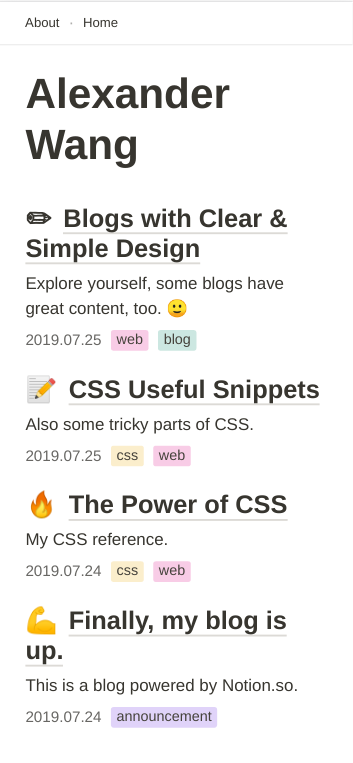
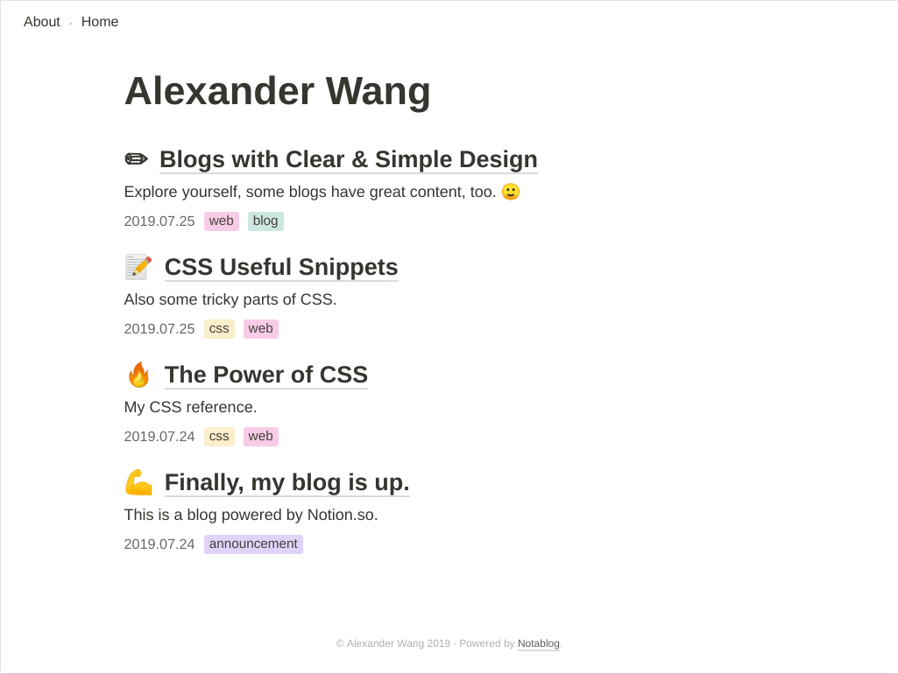

# notablog

Generate a minimal blog from Notion.so.

Some images. 🙂

| Mobile | Desktop |
| :--: | :--: |
|      |      |

### :construction: This is under construction, there may be breaking changes every day! :construction:

## Getting Started

1. Duplicate my [BlogTable template](https://www.notion.so/937c97eb6efb47f5864dc7fa66bbe88a?v=7076048baf9842238b74342f6b491c5b) on Notion.
2. Make the table you've duplicated **public**.
3. Clone the [`notablog-starter`](https://github.com/dragonman225/notablog-starter) repository and install packages.
   ```bash
   git clone https://github.com/dragonman225/notablog-starter.git
   cd notablog-starter && npm install
   ```
4. Open `config.json`. Change `url` field to the URL of the table you've duplicated.
5. Issue command `npm run generate`. Generated static assets are in `public` folder. You can move that folder to your hosting location.

## Customize the Blog

> Below folder paths are relative to the `notablog-starter` you have cloned.

* To edit CSS styles, look for files in `themes/pure/source/css`.
* To edit layouts, look for files in `themes/pure/layout`. These are [Squirrelly](https://squirrelly.js.org/) templates.
  
  * Variables a user can use in `index.html` template :
  
    GraphQL-style overview :
  
    ```javascript
    {
      siteMetadata {
        title
      }
      index {
        posts {
          pageID
          title
          tags {
            value
            color
          }
          icon
          description
          createdTime
          lastEditedTime
        }
      }
    }
    ```
  
    Details :
  
    |       Property       |   Type   |     Description      |
    | :------------------: | :------: | :------------------: |
    | `siteMetadata.title` | `string` |  Title of the blog.  |
    |    `index.posts`     | `Post[]` | Post metadata array. |
  
    A `Post` object :
  
    |   Property    |   Type   |                         Description                          |
    | :-----------: | :------: | :----------------------------------------------------------: |
    |   `pageID`    | `string` |      Notion's page ID. Used as the file name of a post.      |
    |    `title`    | `string` |                       Title of a post.                       |
    |    `tags`     | `Tag[]`  |                       Tags of a post.                        |
    |    `icon`     | `string` |                       Icon of a post.                        |
    | `description` | `string` | Description of a post. This is a HTML string since Notion support styles here. |
    | `createdTime` | `string` |        Created date of the post in YYYY.MM.DD format.        |
  
    A `Tag` object :
  
    | Property |   Type   |                         Description                          |
    | :------: | :------: | :----------------------------------------------------------: |
    | `value`  | `string` |                       Name of the tag.                       |
    | `color`  | `string` | Color of the tag with prefix `tag-`. e.g. `tag-green`, `tag-red`. |
  
  * Variables a user can use in `post.html` template : 
  
    GraphQL-style overview :
    
    ```javascript
    {
      siteMetadata {
        title
      }
      post {
        pageID
        title
        tags {
          value
          color
        }
        icon
        description
        createdTime
        lastEditedTime
      }
      content
    }
    ```
    
    Details :
    
    |       Property       |   Type   |                Description                |
    | :------------------: | :------: | :---------------------------------------: |
    | `siteMetadata.title` | `string` |            Title of the blog.             |
    |        `post`        |  `Post`  |         See above `Post` object.          |
    |      `content`       | `string` | HTML string of the page, including title. |
