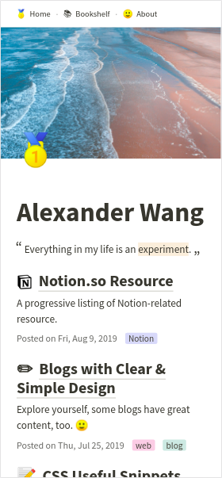
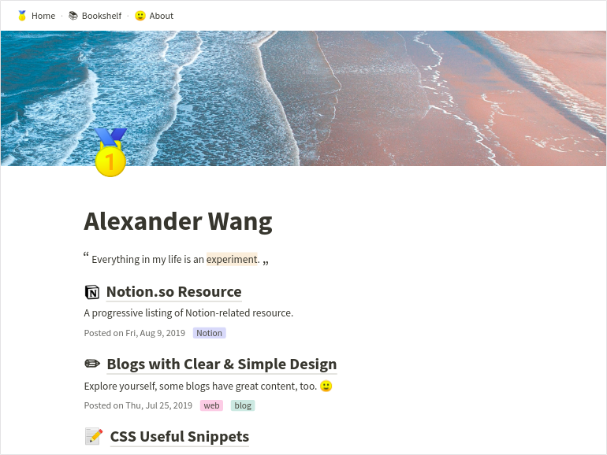
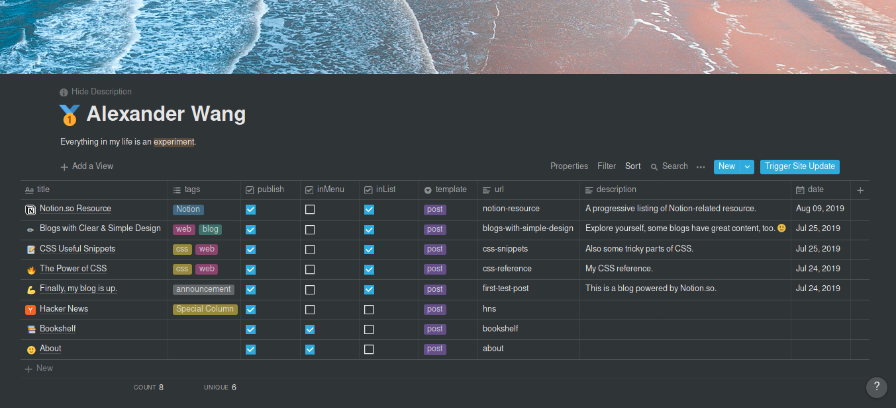
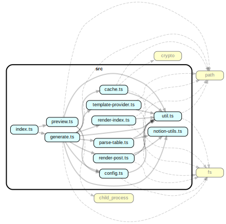

# Notablog

 

Generate a minimalistic blog from a Notion.so table.

Below are some screenshots of [my blog](https://dragonman225.js.org/). 🙂

|            Mobile             |            Desktop             |
| :---------------------------: | :----------------------------: |
|  |  |

| Management Interface on Notion.so |
| :-------------------------------: |
|      |

### :construction: This is under construction, there may be breaking changes often ! :construction:


## Table of Contents

* [Getting Started](#Getting-Started)
* [Blog Management Interface](#Blog-Management-Interface)
* [API Reference](#API-Reference)
* [Notes](#Notes)


## Getting Started

> Make sure you have Node.js v12.0.0 or higher. Check with command `node -v`.

> For existing users who want to upgrade from v0.3.x, please go through all below steps (do a clean install), except that you can continue to use your Notion table.

1. Install Notablog.
   ```bash
   npm i -g notablog
   ```

2. Clone the [`notablog-starter`](https://github.com/dragonman225/notablog-starter) repository.
   ```bash
   git clone https://github.com/dragonman225/notablog-starter.git
   ```
   
3. Duplicate this [Notion table template](https://www.notion.so/b6fcf809ca5047b89f423948dce013a0?v=03ddc4d6130a47f8b68e74c9d0061de2).

4. Make the table you've duplicated **public** and **copy its URL** for the next step.

5. Go into `notablog-starter/` directory, open `config.json`. Replace the value of `url` with the URL of the table you've duplicated.

6. Inside `notablog-starter/` directory, run command:

   ```bash
   notablog generate .
   ```

7. After it finishes, go to `notablog-starter/public/` directory, open `index.html` with a browser to preview your site.

* Optionally, you could change the `previewBrowser` field in `config.json` to the path of a browser executable you have on your computer and issue the following command anywhere to preview.

   ```bash
   notablog preview <path_to_the_notablog-starter>
   ```

### Congratulations! Your website is ready now!

* You can copy files in  `notablog-starter/public/` directory to a server or upload them to any static hosting service to share your content with the world.

* Whenever you want to update your site, go into `notablog-starter/` directory and issue command `notablog generate .`, or issue the command from outside `notablog-starter/` with the pattern `notablog generate <path_to_the_notablog-starter>`.

* Some options for static hosting services:

  * [Github Pages](https://pages.github.com/)
  * [Netlify](https://www.netlify.com/)
  * [surge.sh](https://surge.sh)

* Some options for self-hosting:

  * [nginx](https://www.nginx.com/)
  * [lighttpd](https://www.lighttpd.net/)
  * [Apache httpd](https://httpd.apache.org/)


## Blog Management Interface

This is the documentation of [Notion table template](https://www.notion.so/b6fcf809ca5047b89f423948dce013a0?v=03ddc4d6130a47f8b68e74c9d0061de2)

|  Column Name  | Property Type  |                         Description                          |
| :-----------: | :------------: | :----------------------------------------------------------: |
|    `title`    |    `Title`     |                       The page title.                        |
|    `tags`     | `Multi-Select` |                 Topics related to the page.                  |
|   `publish`   |   `Checkbox`   |           Determine if a page should be rendered.            |
|   `inMenu`    |   `Checkbox`   |   Determine if a page should appear in the navigation bar.   |
|   `inList`    |   `Checkbox`   |    Determine if a page should appear in the article list.    |
|  `template`   |    `Select`    | Specify which template to use for the page. Available template names depend on the theme you use. |
|     `url`     |     `Text`     | A string to be used as the filename and the URL of the generated page. It should not contain `/` and `\`. If it's empty, the `id` of the page is used. |
| `description` |     `Text`     |         Short intro of the page. Styles are working.         |
|    `date`     |     `Date`     | User customizable date, convenient for importing posts from other platforms or adjusting the order of posts. |

* **Hack**: Check `publish` but leave `inMenu` and `inList` unchecked to make a page seem like *hidden* because people can only view it when they know its URL.


## API Reference (Outdated)

### Introduction

`notablog` itself is designed to be installed as a dependency, and invoked from NPM script. This way we can separate application code and user assets so that it's less confusing for a user. To make things even more simple, I have prepared [`notablog-starter`](https://github.com/dragonman225/notablog-starter), so a user doesn't have to setup folder structure manually. The concept is inspired by a popular project [hexo](https://github.com/hexojs/hexo).

With the design, a user only sees `notablog-starter` when using, therefore the following documentation will be in the context of `notablog-starter`.

### Simplified Folder Structure

```
notablog-starter
├── config.json
├── public
├── source
│   └── notion_cache
└── themes
    └── pure
```

- `config.json` - Site config.

  | Field |  Type  |                         Description                          |
  | :---: | :----: | :----------------------------------------------------------: |
  |  url  | string |     The URL of a Notion table compatible with Notablog.      |
  | theme | string | The theme to use. It should be one of the folder names in `themes/`. |

- `public/` - Contains generated static assets of the blog.

- `source/notion_cache/` - Cached JSON files of Notion pages. They are used when a user runs `npm run generate`, if a page contains no changes, the generator reads data from these cached files.

- `themes/` - Store themes.

### Theme

A theme contains layout templates, CSS files, fonts, and other assets that shapes the style and look of a blog.

#### Folder Structure

```
<name>
├── layout
└── assets
```

* `<name>` - Theme folder name, also the name to be used in `notablog-starter/config.json`.
* `layout/` - Contains page templates. It is required to have at least one index layout (`index.html`) and one post layout (`post.html`). You can have more templates, and a user can use those bonus templates by specifying the template's filename in `template` field on Notion.
* `assets/` - Other assets. Anything in this folder will be copied to `notablog-starter/public/` when running `npm run generate`.

#### Template Language

* Currently, I use [Squirrelly.js](https://squirrelly.js.org/) as template engine.

* Template `index.html` gets the following structure of data :

  ```
  {
		siteMeta {
			icon // Emoji or URL
			iconHTML // Rendered HTML
			cover // URL
			title // String
			description // Raw array, do not use
			descriptionPlain // Rendered plain text, no style
			descriptionHTML // Rendered HTML, with style
			pages { // An array of page
				id // Notion's page id
				icon // Emoji or URL
				iconHTML // Rendered HTML
				cover // URL
				title // String
				tags // An array, [{ color: string, value: string }]
				publish // Boolean, `true` if publish is checked.
				inMenu // Boolean, `true` if inMenu is checked.
				inList // Boolean, `true` if inList is checked.
				template // Template name
				url // URL of the page relative to site root
				description // Raw array, do not use
				descriptionPlain // Rendered plain text, no style
				descriptionHTML // Rendered HTML, with style
				date // Raw string, e.g. 2019-08-09
				dateString // Formatted, e.g. Fri, Aug 9, 2019
				createdTime // Unix timestamp
				lastEditedTime // Unix timestamp
			}
		}
  }
  ```

* Template `post.html` or others gets the following structure of data :

  ```
  {
		siteMeta // The same as "siteMeta" in index.html
		post {
			...post // All properties of a page in "siteMeta.pages"
			contentHTML // HTML of post body
		}
  }
  ```

> It is highly recommended to take a look at [notablog-theme-pure](https://github.com/dragonman225/notablog-theme-pure) if you want to make your own !


## Notes

### Code Structure

Generated by `dependency-cruiser` NPM package.



### Project Status

See https://dragonman225.js.org/notablog-stat.html
