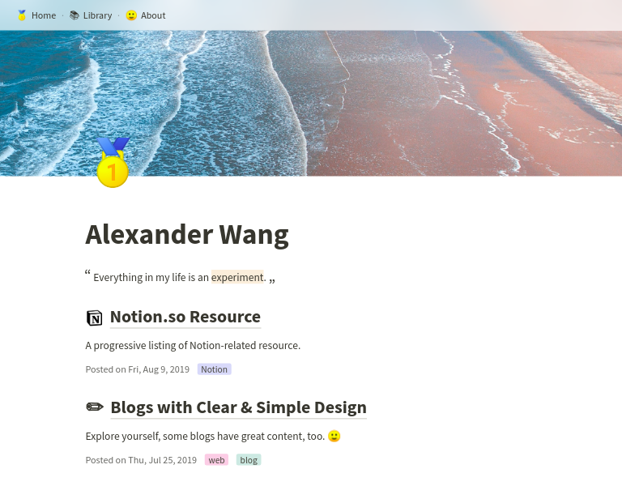

# notablog

 

Generate a minimalistic blog from a Notion.so table.

Here are some images of [my blog](https://dragonman225.github.io/), built with [notablog-theme-pure](https://github.com/dragonman225/notablog-theme-pure)(the default theme). 🙂

| Mobile | Desktop |
| :--: | :--: |
|      |      |

| Management Interface on Notion.so |
| :----------------------------: |
|  |

### :construction: This is under construction, there may be breaking changes often ! :construction:

## Table of Contents

* [Getting Started](#Getting-Started)
* [Blog Management Interface](#Blog-Management-Interface)
* [API Reference](#API-Reference)
* [Notes](#Notes)

## Getting Started

1. Clone the [`notablog-starter`](https://github.com/dragonman225/notablog-starter) repository and install dependencies.
   ```bash
   git clone https://github.com/dragonman225/notablog-starter.git
   cd notablog-starter && npm install
   ```

2. While it's installing, go to this [Notion table template](https://www.notion.so/b6fcf809ca5047b89f423948dce013a0?v=03ddc4d6130a47f8b68e74c9d0061de2) and duplicate it.

3. Make the table you've duplicated **public** and **copy its URL** (for the next step).

4. Go back to `notablog-starter`, open `config.json`. Replace the value of `url` with the URL of the table you've duplicated (the one you copied in previous step).

5. If `npm install` finishes, issue command `npm run generate`.

6. Go to `public` folder, open `index.html` in a browser to preview your blog.

* Now, your blog is ready. You can edit something on Notion, then `npm run generate` again to update the generated blog.

* Next, you can upload the `public` folder to any **static hosting** service or your **own server** to share your blog globally.

* [Github Pages](https://pages.github.com/), [Netlify](https://www.netlify.com/), [surge.sh](https://surge.sh) are some choices for static hosting service. [nginx](https://www.nginx.com/), [lighttpd](https://www.lighttpd.net/), [Apache httpd](https://httpd.apache.org/) are some choices for self-hosted server.

## Blog Management Interface

* `title` - The page title.

* `tags` - Topics related to the page. It's a multi-select option.

* `publish` - Determine if a page should be rendered.

*  `inMenu` - Determine if a page should appear in the topbar menu.

* `inList` - Determine if a page should appear in the list of posts.

  **Trick** : Check `publish` but leave `inMenu` and `inList` unchecked to create a *hidden* page which people can access only if knowing its URL.

* `template` - Specify which template to use for the page. Available template names depend on which theme you use.

* `url` - A string to be used as the filename and the URL of the generated page. It should not contain `/` and `\`. It can be empty, in this case, the `id` of the page is used for filename and URL.

* `description` - Short intro of the page. Styles are working.

* `date` - User customizable, convenient for importing posts from other platforms and adjusting the order of posts.

## API Reference

`notablog` itself is designed to be installed as a dependency, and invoked from a NPM script. This way we can separate application code and user assets so that it's less confusing for a user. To make things even more simple, the [`notablog-starter`](https://github.com/dragonman225/notablog-starter) is prepared, so a user doesn't have to setup the folders and files manually. The concept is inspired by a popular project [hexo](https://github.com/hexojs/hexo).

Therefore, the following documentation is in the context of `notablog-starter`.

### Simplified Folder Structure

```
notablog-starter
├── config.json
├── public
├── source
│   └── notion_cache
└── themes
    └── pure
```

- `config.json` - Site config.

  | Field |  Type  |                         Description                          |
  | :---: | :----: | :----------------------------------------------------------: |
  |  url  | string |     The URL of a Notion table compatible with Notablog.      |
  | theme | string | The theme to use. It should be one of the folder names in `themes/`. |

- `public/` - Contains the generated blog.

- `source/notion_cache/` - Store data of Notion pages in JSON. This speeds up blog generation since only pages with changes are downloaded again from Notion, other pages are rendered from these cached data.

- `themes/` - Store themes.

### Theme

A theme is a collection of layout templates, CSS files, fonts, and other assets that defines the style and look of a blog.

A theme is required to have at least one index layout and one post layout to function correctly.

## Notes

### Code Structure

Generated by `dependency-cruiser` NPM package.

