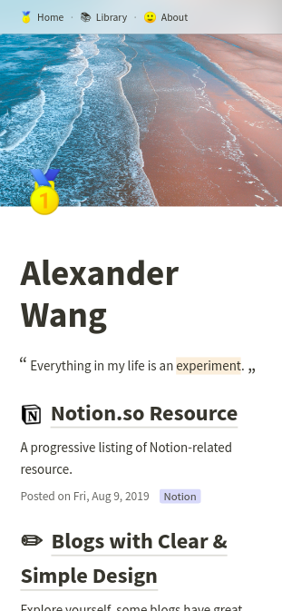

# notablog

Generate a minimalistic blog from a Notion.so table.

Here are some images of my blog, built with [notablog-theme-pure](https://github.com/dragonman225/notablog-theme-pure)(the default theme). 🙂 [Visit site](https://dragonman225.github.io/)

| Mobile | Desktop |
| :--: | :--: |
|      |      |

| Management Interface on Notion.so |
| :----------------------------: |
|  |

### :construction: This is under construction, there may be breaking changes every day! :construction:

## Getting Started

1. Duplicate my [table template v0.3.0](https://www.notion.so/b6fcf809ca5047b89f423948dce013a0?v=03ddc4d6130a47f8b68e74c9d0061de2) on Notion.

2. Make the table you've duplicated **public**.

3. Clone the [`notablog-starter`](https://github.com/dragonman225/notablog-starter) repository and install it.
   ```bash
   git clone https://github.com/dragonman225/notablog-starter.git
   cd notablog-starter && npm install
   ```
   
4. Open `config.json`. Change `url` field to the URL of the table you've duplicated.

5. Issue command `npm run generate`.

6. Generated blog is the `public` folder. You can open `public/index.html` in a browser to preview.  

7. If you want to host the blog on the internet, either can you build your own server or use static hosting services like [Github Pages](https://pages.github.com/), [Netlify](https://www.netlify.com/), etc.

## Customize the Blog (for >= v0.3.0)

TBD

## Customize the Blog (for <= v0.2.1)

> Below folder paths are relative to the `notablog-starter` you have cloned.

* To edit CSS styles, look for files in `themes/pure/source/css`.
* To edit layouts, look for files in `themes/pure/layout`. These are [Squirrelly](https://squirrelly.js.org/) templates.
  
  * Variables a user can use in `index.html` template :
  
    GraphQL-style overview :
  
    ```javascript
    {
      siteMetadata {
        title
      }
      index {
        posts {
          pageID
          title
          tags {
            value
            color
          }
          icon
          description
          createdTime
          lastEditedTime
        }
      }
    }
    ```
  
    Details :
  
    |       Property       |   Type   |     Description      |
    | :------------------: | :------: | :------------------: |
    | `siteMetadata.title` | `string` |  Title of the blog.  |
    |    `index.posts`     | `Post[]` | Post metadata array. |
  
    A `Post` object :
  
    |   Property    |   Type   |                         Description                          |
    | :-----------: | :------: | :----------------------------------------------------------: |
    |   `pageID`    | `string` |      Notion's page ID. Used as the file name of a post.      |
    |    `title`    | `string` |                       Title of a post.                       |
    |    `tags`     | `Tag[]`  |                       Tags of a post.                        |
    |    `icon`     | `string` |                       Icon of a post.                        |
    | `description` | `string` | Description of a post. This is a HTML string since Notion support styles here. |
    | `createdTime` | `string` |        Created date of the post in YYYY.MM.DD format.        |
  
    A `Tag` object :
  
    | Property |   Type   |                         Description                          |
    | :------: | :------: | :----------------------------------------------------------: |
    | `value`  | `string` |                       Name of the tag.                       |
    | `color`  | `string` | Color of the tag with prefix `tag-`. e.g. `tag-green`, `tag-red`. |
  
  * Variables a user can use in `post.html` template : 
  
    GraphQL-style overview :
    
    ```javascript
    {
      siteMetadata {
        title
      }
      post {
        pageID
        title
        tags {
          value
          color
        }
        icon
        description
        createdTime
        lastEditedTime
      }
      content
    }
    ```
    
    Details :
    
    |       Property       |   Type   |                Description                |
    | :------------------: | :------: | :---------------------------------------: |
    | `siteMetadata.title` | `string` |            Title of the blog.             |
    |        `post`        |  `Post`  |         See above `Post` object.          |
    |      `content`       | `string` | HTML string of the page, including title. |

## Project Structure

